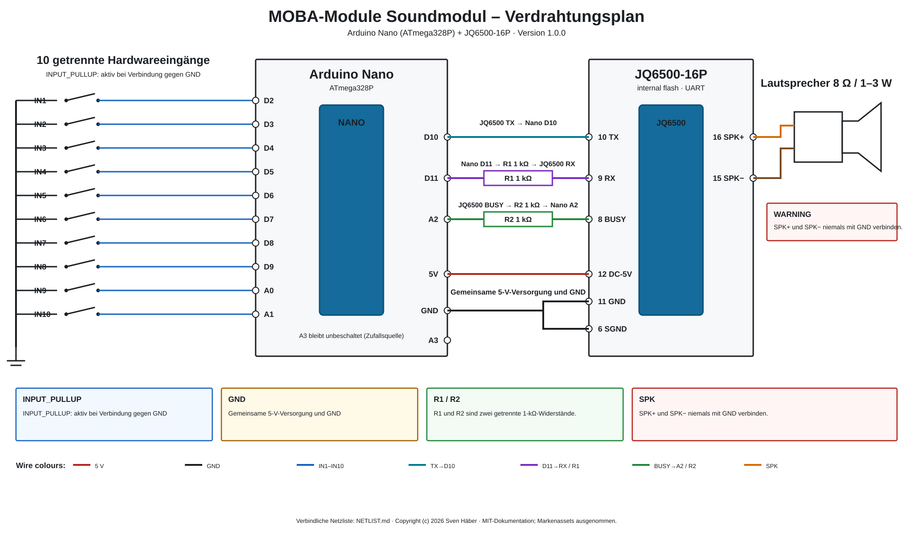

# Hardware und Verdrahtung

## Verbindlicher Verdrahtungsplan



Die bearbeitbare SVG-Datei und die verbindliche Netzliste liegen unter
[`docs/assets/wiring/`](../assets/wiring/README.md).

## Benötigte Komponenten

- Arduino Nano mit ATmega328P;
- JQ6500-16P mit internem Flash-Speicher;
- **zwei getrennte Widerstände mit jeweils 1 kΩ**:
  - R1 in der Leitung Nano D11 zum JQ6500-RX;
  - R2 in der Leitung JQ6500-BUSY zu Nano A2;
- geeigneter Lautsprecher, empfohlen 8 Ω und 1 bis 3 W;
- bis zu zehn Schalter oder externe Open-Collector-Kontakte;
- ausreichend dimensionierte, stabilisierte 5-V-Versorgung;
- gemeinsame Masse zwischen Nano, JQ6500, Versorgung und externen Eingängen;
- empfohlen: C1 470 µF / 10 V und C2 100 nF möglichst nahe am JQ6500.

## JQ6500-Verbindung

```text
JQ6500 Pin 10 TX    -> Nano D10
Nano D11            -> R1 1 kΩ -> JQ6500 Pin 9 RX
JQ6500 Pin 8 BUSY   -> R2 1 kΩ -> Nano A2
Nano 5V             -> JQ6500 Pin 12 DC-5V
Nano GND            -> JQ6500 Pin 11 GND
Nano GND            -> JQ6500 Pin 6 SGND
JQ6500 Pin 16 SPK+  -> Lautsprecher +
JQ6500 Pin 15 SPK-  -> Lautsprecher -
```

R1 und R2 sind zwei eigenständige Bauteile. Sie dürfen nicht durch einen
gemeinsamen Widerstand ersetzt werden.

`SPK+` und `SPK-` sind ein Brückenausgang. Keinen der beiden
Lautsprecheranschlüsse mit GND verbinden.

Nano und JQ6500 dürfen nicht gleichzeitig aus zwei parallel verbundenen
5-V-Quellen gespeist werden. Bei USB-Verbindung und externer Versorgung die
Versorgungssituation vorher eindeutig festlegen.

## Hardwareeingänge

```text
IN1  -> D2
IN2  -> D3
IN3  -> D4
IN4  -> D5
IN5  -> D6
IN6  -> D7
IN7  -> D8
IN8  -> D9
IN9  -> A0
IN10 -> A1
```

Jeder Schalter wird zwischen Eingang und GND angeschlossen. Die Firmware
verwendet `INPUT_PULLUP`; ein Eingang ist daher aktiv, wenn er gegen GND gezogen
wird.

A3 bleibt unbeschaltet und dient als zusätzliche Zufallsquelle.

## JQ6500 vorab mit Sounds bespielen

Der JQ6500 muss vor der Nutzung separat über USB mit den gewünschten
Sounddateien befüllt werden. Die Firmware und die Windows-Anwendung übernehmen
diesen Schreibvorgang nicht. Anleitung:
[docs/de/jq6500-sounds.md](jq6500-sounds.md).

## BUSY-Referenzwerte

Mit eingebautem Serienwiderstand R2 1 kΩ wurden am 2. August 2026 folgende
Werte erneut bestätigt:

- Wiedergabe: ungefähr 537 bis 540 ADC-Schritte;
- Leerlauf: ungefähr 2 bis 3 ADC-Schritte.

Die Firmware-Schwellen bleiben damit unverändert:

- BUSY ein: 350 ADC-Schritte;
- BUSY aus: 150 ADC-Schritte.
