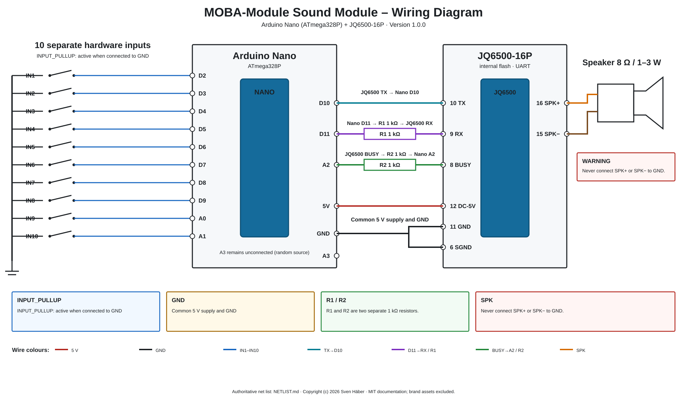

# Hardware and wiring

## Authoritative wiring diagram



The editable SVG source and authoritative net list are stored under
[`docs/assets/wiring/`](../assets/wiring/README.md).

## Required components

- Arduino Nano compatible with ATmega328P;
- JQ6500-16P audio module with internal flash;
- **two separate 1 kΩ resistors**:
  - R1 between Nano D11 and JQ6500 RX;
  - R2 between JQ6500 BUSY and Nano A2;
- suitable speaker, recommended 8 Ω and 1 to 3 W;
- up to ten switches or external open-collector contacts;
- adequately rated regulated 5 V supply;
- common ground between Nano, JQ6500, power supply and external inputs;
- recommended: C1 470 µF / 10 V and C2 100 nF close to the JQ6500.

## JQ6500 connection

```text
JQ6500 pin 10 TX    -> Nano D10
Nano D11            -> R1 1 kΩ -> JQ6500 pin 9 RX
JQ6500 pin 8 BUSY   -> R2 1 kΩ -> Nano A2
Nano 5V             -> JQ6500 pin 12 DC-5V
Nano GND            -> JQ6500 pin 11 GND
Nano GND            -> JQ6500 pin 6 SGND
JQ6500 pin 16 SPK+  -> speaker +
JQ6500 pin 15 SPK-  -> speaker -
```

R1 and R2 are separate components. Do not replace them with one shared
resistor.

`SPK+` and `SPK-` form a bridge output. Never connect either speaker terminal
to GND.

Do not power Nano and JQ6500 from two 5 V sources connected in parallel. Define
the power arrangement before combining USB and external power.

## Hardware inputs

```text
IN1  -> D2
IN2  -> D3
IN3  -> D4
IN4  -> D5
IN5  -> D6
IN6  -> D7
IN7  -> D8
IN8  -> D9
IN9  -> A0
IN10 -> A1
```

Connect each switch between its input and GND. The firmware enables
`INPUT_PULLUP`, so an input is active when pulled low.

A3 remains unconnected and is used as an additional random seed source.

## Load sounds before use

Program the JQ6500 separately over USB before use. The firmware and Windows
application do not perform this write operation. See
[docs/en/jq6500-sounds.md](jq6500-sounds.md).

## BUSY reference values

With the mandatory R2 1 kΩ series resistor installed, the following values were
re-confirmed on 2 August 2026:

- playing: approximately 537 to 540 ADC counts;
- idle: approximately 2 to 3 ADC counts.

The firmware thresholds therefore remain unchanged:

- BUSY on: 350 ADC counts;
- BUSY off: 150 ADC counts.
